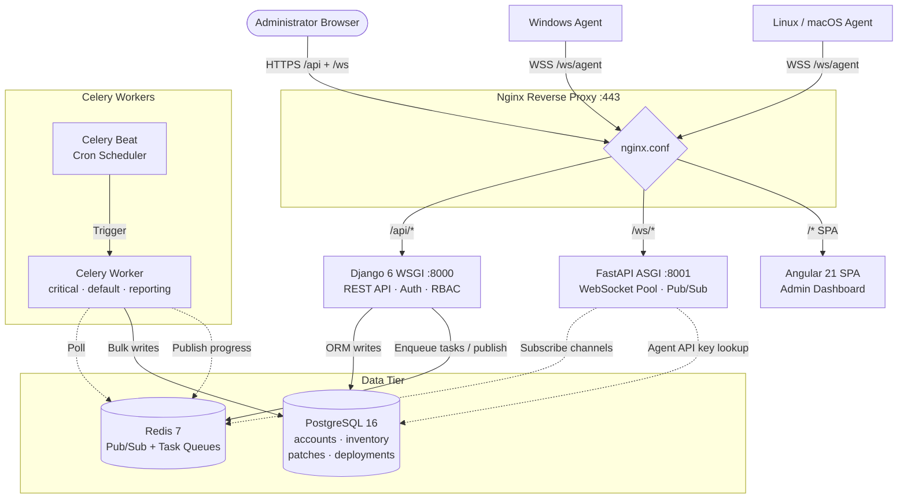

# PatchGuard Enterprise

**PatchGuard** is an enterprise-grade centralized patch management platform. It orchestrates remote fleet patching across Windows, Linux, and macOS endpoints, tracks real-time deployment telemetry, enforces compliance policies, and provides role-based access control with AD/LDAP integration.

This monorepo houses all system components: Django REST API, FastAPI WebSocket layer, Angular SPA, Celery task engine, and Python hardware agents.

---

## Build Status

| Component | Stack | Status |
|-----------|-------|--------|
| Backend API | Django 6.0 + DRF 3.15 | ✅ Complete |
| Auth System | SimpleJWT 5.3 + LDAP | ✅ Complete |
| Task Engine | Celery 5.4 + Redis 7 | ✅ Complete |
| Real-Time Layer | FastAPI 0.110 + WebSockets | ✅ Complete |
| Frontend Core | Angular 21.2 (Signals) | ✅ Complete |
| Agent | Python 3.12+ (WS + REST) | ✅ Complete |
| Test Suite | pytest + Angular Karma | ⬜ Not Started |

**Overall Progress: 39/44 tasks (89%)**

---

## Table of Contents

- [System Architecture](#system-architecture)
- [Technology Stack](#technology-stack)
- [Monorepo Structure](#monorepo-structure)
- [Local Development Setup (Windows)](#local-development-setup-windows)
- [Local Development Setup (Docker)](#local-development-setup-docker)
- [VS Code Launch Configurations](#vs-code-launch-configurations)
- [API Reference](#api-reference)
- [WebSocket Protocol](#websocket-protocol)
- [Authentication & RBAC](#authentication--rbac)
- [Data Model Overview](#data-model-overview)
- [Celery Tasks & Beat Schedule](#celery-tasks--beat-schedule)
- [Agent Configuration](#agent-configuration)
- [Core Design Decisions](#core-design-decisions)
- [Progress](#progress)

> For a concise how-to guide covering setup, common workflows, and contributing, see [DEVELOPER.md](DEVELOPER.md).

---

## System Architecture

PatchGuard implements a **Tri-Layer Microservices Topology** connected via a Redis-backed Event Bus. REST operations, WebSocket persistence, and async task execution run in isolated processes.

```
┌─────────────────────────────────────────────────────────────────────┐
│                         EXTERNAL CLIENTS                            │
│                                                                     │
│   ╔══════════════╗    ╔══════════════╗    ╔══════════════════════╗ │
│   ║  Admin UI    ║    ║ Windows Agent║    ║    Linux/macOS Agent ║ │
│   ║ (Browser SPA)║    ║  agent.py    ║    ║      agent.py        ║ │
│   ╚══════╤═══════╝    ╚══════╤═══════╝    ╚══════════╤═══════════╝ │
│          │ HTTPS             │ WSS                    │ WSS         │
└──────────┼───────────────────┼────────────────────────┼────────────┘
           │                   │                        │
           ▼                   ▼                        ▼
┌─────────────────────────────────────────────────────────────────────┐
│                      NGINX REVERSE PROXY (:443)                     │
│   /api/*  ──────────────────────────────────────► Django (:8000)    │
│   /ws/*   ──────────────────────────────────────► FastAPI (:8001)   │
│   /*      ──────────────────────────────────────► Angular Static    │
└───────────────┬─────────────────────┬───────────────────────────────┘
                │                     │
                ▼                     ▼
┌───────────────────────┐   ┌─────────────────────────────────────────┐
│   DJANGO (WSGI)       │   │           FASTAPI (ASGI)                │
│   Core REST API       │   │         Real-Time Service               │
│                       │   │                                         │
│  • JWT Auth + LDAP    │   │  • WebSocket pool management            │
│  • RBAC Permissions   │   │  • Agent command dispatch               │
│  • Patch state machine│   │  • Redis Pub/Sub subscriber             │
│  • Deployment wizard  │   │  • Dashboard event fan-out              │
│  • OpenAPI/Swagger    │   │  • JWT verification (shared secret)     │
└──────────┬────────────┘   └──────────────────┬──────────────────────┘
           │                                    │
           │  Write/Read                        │  Subscribe
           ▼                                    ▼
┌───────────────────────────────────────────────────────────────────┐
│                         DATA TIER                                 │
│                                                                   │
│  ╔══════════════════╗          ╔═════════════════════════════╗    │
│  ║  PostgreSQL 16   ║          ║       Redis 7               ║    │
│  ║                  ║          ║                             ║    │
│  ║ • accounts       ║          ║ Pub/Sub Channels:           ║    │
│  ║ • inventory      ║          ║  deployment:<id>            ║    │
│  ║ • patches        ║  ◄────   ║  device:status              ║    │
│  ║ • deployments    ║  Write   ║  notifications              ║    │
│  ║ • audit_log      ║          ║  compliance:alert           ║    │
│  ║ (partitioned)    ║          ║  agent:command:<device_id>  ║    │
│  ╚══════════════════╝          ║                             ║    │
│                                ║ Task Queues:                ║    │
│                                ║  critical / default /       ║    │
│                                ║  reporting                  ║    │
│                                ╚══════════════╤══════════════╝    │
└───────────────────────────────────────────────┼───────────────────┘
                                                │ Poll
                                                ▼
                               ┌─────────────────────────────┐
                               │     CELERY WORKERS          │
                               │                             │
                               │  Beat Schedule (cron):      │
                               │  • Vendor patch sync (6h)   │
                               │  • Stale device check (5m)  │
                               │  • Compliance snapshot (1d) │
                               │  • Scheduled deployments(1m)│
                               │  • Partition cleanup (1mo)  │
                               │                             │
                               │  Task Queues:               │
                               │  • execute_deployment       │
                               │  • scan_device_patches      │
                               │  • cancel_deployment_task   │
                               └─────────────────────────────┘
```



---

## Technology Stack

| Layer | Technology | Version | Purpose |
|-------|-----------|---------|---------|
| Backend | Python | 3.12+ | Runtime |
| Backend | Django | 6.0.3 | ORM, REST, Auth |
| Backend | Django REST Framework | 3.15.2 | API serialization + ViewSets |
| Backend | SimpleJWT | 5.3.1 | JWT access/refresh tokens |
| Backend | drf-spectacular | 0.27.2 | OpenAPI 3.1 schema + Swagger UI |
| Backend | Celery | 5.4.0 | Distributed task queue |
| Backend | django-celery-beat | 2.7.0 | Persistent cron schedules |
| Real-Time | FastAPI | 0.110.0 | ASGI WebSocket server |
| Real-Time | Uvicorn | 0.29.0 | ASGI runner |
| Real-Time | aiohttp | 3.9.0+ | Async HTTP (agent callbacks) |
| Frontend | Angular | 21.2 | SPA framework (Signals + Standalone) |
| Frontend | TypeScript | 5.9 | Typed JavaScript |
| Database | PostgreSQL | 16 | Primary datastore (partitioned audit log) |
| Cache/Queue | Redis | 7 | Pub/Sub + Celery broker/result backend |
| Proxy | Nginx | alpine | TLS termination + routing (production) |

---

## Monorepo Structure

```text
PatchGuard/
├── agent/                          # Python endpoint agent
│   ├── agent.py                    # WS + REST heartbeat, scan/patch execution
│   ├── config.yaml                 # Server URL, API key, intervals
│   └── plugins/                    # OS-specific patch backends
│       ├── windows.py              # Windows Update API
│       ├── linux.py                # apt/yum
│       └── macos.py                # softwareupdate
│
├── backend/                        # Django REST API
│   ├── manage.py                   # Entry point (thread-safe signal handling)
│   ├── celery_worker.py            # Celery CLI wrapper
│   ├── apps/
│   │   ├── accounts/               # Users, roles, JWT, LDAP, audit log
│   │   ├── inventory/              # Devices, DeviceGroups, heartbeat
│   │   ├── patches/                # Patch catalog, state machine, DevicePatchStatus
│   │   └── deployments/            # Deployment lifecycle, waves, Celery tasks
│   ├── common/                     # Shared: middleware, pagination, Redis pub/sub
│   ├── config/
│   │   ├── settings/{base,dev,prod}.py
│   │   ├── celery_app.py           # Celery app + Beat schedule
│   │   └── urls.py                 # Root URL conf
│   └── requirements/{base,dev,prod}.txt
│
├── frontend/                       # Angular 21 SPA
│   ├── src/app/
│   │   ├── core/                   # AuthService, Guards, Interceptor, ApiService
│   │   │   └── services/           # Device/Patch/Deployment/WebSocket/Report services
│   │   └── features/              # Feature modules (login, dashboard, etc.)
│   └── proxy.conf.json            # Dev proxy: /api → :8000, /ws → :8001
│
├── realtime/                       # FastAPI WebSocket service
│   ├── main.py                     # App factory, Redis sub loop
│   ├── auth.py                     # JWT + agent API key verification
│   ├── ws_manager.py               # ConnectionManager (dashboard + agent pools)
│   └── routes/{agents,events,health}.py
│
├── nginx/nginx.conf                # Production reverse proxy
├── scripts/
│   ├── seed-data.py                # Dev seed data (users, devices, patches)
│   ├── init-db.sh                  # DB init (roles, migrations)
│   └── generate-certs.sh           # Self-signed TLS certs
│
├── docker-compose.yml              # Dev: postgres, redis, django, fastapi, celery, frontend
├── docker-compose.prod.yml         # Prod: + nginx, pgbouncer, resource limits
├── .env                            # Environment variables
└── .vscode/launch.json             # VS Code launch configs (see below)
```

---

## Local Development Setup (Windows)

Run all services natively on Windows **without Docker**. Tested on Windows 10/11 with Python 3.12+.

### Prerequisites

| Tool | Required | Install |
|------|----------|---------|
| Python 3.12+ | Yes | [python.org](https://www.python.org/downloads/) |
| PostgreSQL 16 | Yes | [postgresql.org](https://www.postgresql.org/download/windows/) |
| Redis 7 | Yes | [Redis for Windows](https://github.com/tporadowski/redis/releases) or WSL |
| Node.js 20+ | Yes (frontend) | [nodejs.org](https://nodejs.org/) |
| Git | Yes | [git-scm.com](https://git-scm.com/) |

### Step 1: Clone & Create Virtual Environment

```powershell
git clone <repo-url> D:\PatchGuard
cd D:\PatchGuard
python -m venv .venv
.\.venv\Scripts\Activate.ps1
```

### Step 2: Install Dependencies

```powershell
# Backend + Realtime + Agent (shared venv)
pip install -r backend/requirements/dev.txt
pip install -r realtime/requirements.txt
pip install -r agent/requirements.txt

# Frontend
cd frontend
npm install
cd ..
```

### Step 3: Configure Environment

Copy `.env` and edit as needed:

```powershell
# Key variables in .env:
POSTGRES_HOST=localhost
POSTGRES_PORT=5432
POSTGRES_USER=postgres
POSTGRES_PASSWORD=<your-password>
POSTGRES_DB=vector_db
REDIS_URL=redis://localhost:6379/0
DJANGO_SETTINGS_MODULE=config.settings.dev
BACKEND_URL=http://localhost:8000/api/v1
```

### Step 4: Initialize Database

```powershell
cd backend
$env:DJANGO_SETTINGS_MODULE="config.settings.dev"

# Run migrations
python manage.py migrate

# Load seed data (creates users, devices, patches)
cd ..
$env:PYTHONPATH="$PWD\backend"
python scripts/seed-data.py
```

### Step 5: Start All Services

Open **5 terminals** (or use VS Code compound launch — see below):

**Terminal 1 — Django API (port 8000)**
```powershell
cd backend
$env:DJANGO_SETTINGS_MODULE="config.settings.dev"
python manage.py runserver 127.0.0.1:8000
```

**Terminal 2 — FastAPI WebSocket (port 8001)**
```powershell
cd realtime
python -m uvicorn main:app --host 127.0.0.1 --port 8001 --reload
```

**Terminal 3 — Celery Worker**
```powershell
cd backend
$env:DJANGO_SETTINGS_MODULE="config.settings.dev"
python celery_worker.py -A config.celery_app worker --loglevel=info -Q critical,default,reporting --concurrency=4 --pool=solo
```

> **Windows Note:** `--pool=solo` is required. Celery's default prefork pool does not work on Windows.

**Terminal 4 — Angular Frontend (port 4200)**
```powershell
cd frontend
npx ng serve --proxy-config proxy.conf.json --host 127.0.0.1 --port 4200
```

**Terminal 5 — Agent (optional)**
```powershell
cd agent
python agent.py
```

### Step 6: Verify

| Service | URL | Expected |
|---------|-----|----------|
| Angular UI | http://127.0.0.1:4200 | Login page |
| Django API | http://127.0.0.1:8000/api/health/ | `{"status": "ok"}` |
| Swagger UI | http://127.0.0.1:8000/api/docs/ | Interactive docs |
| ReDoc | http://127.0.0.1:8000/api/redoc/ | API reference |
| FastAPI Health | http://127.0.0.1:8001/health | `{"status": "ok"}` |
| FastAPI Docs | http://127.0.0.1:8001/docs | WebSocket docs |

### Test Credentials (from seed data)

| Username | Password | Role |
|----------|----------|------|
| `admin` | `Admin@123456` | admin (full access) |
| `operator` | `Operator@123456` | operator (deploy + manage) |
| `viewer` | `Viewer@123456` | viewer (read-only) |

### Quick Login Test

```powershell
# Get JWT tokens
Invoke-RestMethod -Uri http://127.0.0.1:8000/api/auth/login/ `
  -Method POST -ContentType "application/json" `
  -Body '{"username":"admin","password":"Admin@123456"}'
```

---

## Local Development Setup (Docker)

```powershell
# Start all services
docker compose up --build -d

# Run migrations + seed
docker compose exec django python manage.py migrate
docker compose exec django python /app/scripts/seed-data.py

# View logs
docker compose logs -f
```

### Docker Services

| Service | Port | Description |
|---------|------|-------------|
| `postgres` | 127.0.0.1:5432 | PostgreSQL 16 |
| `redis` | 127.0.0.1:6379 | Redis 7 |
| `django` | 8000 | Django REST API |
| `fastapi` | 8001 | FastAPI WebSocket |
| `celery-worker` | — | Background task processing |
| `celery-beat` | — | Cron scheduler |
| `frontend` | 4200 | Angular dev server |

### Production Docker

```powershell
docker compose -f docker-compose.prod.yml up -d
```

Adds: **nginx** (TLS on :443), **pgbouncer** (connection pooling), gunicorn, resource limits. Frontend served as static files through nginx.

---

## VS Code Launch Configurations

The project includes pre-configured launch configs in `.vscode/launch.json`.

### Individual Services

| Config Name | What It Starts |
|-------------|----------------|
| `Django: Run Server` | Django on 127.0.0.1:8000 (with auto-reload) |
| `Realtime (WS): Server` | FastAPI on 127.0.0.1:8001 (with auto-reload) |
| `Celery: Worker` | Celery worker (`--pool=solo` for Windows) |
| `Celery: Beat` | Celery Beat scheduler |
| `Angular: Serve` | Angular dev server on 127.0.0.1:4200 with proxy |
| `Agent: Run` | Python agent (connects via WS to FastAPI) |

### Compound Launches (start multiple at once)

| Compound Name | Services Started |
|---------------|------------------|
| **Full Stack (Django+FastAPI+Celery)** | Django + FastAPI + Celery Worker |
| **Full Stack + Frontend** | Django + FastAPI + Celery + Angular |
| **Everything** | All above + Celery Beat + Agent |

### Utility Configs

| Config Name | Purpose |
|-------------|---------|
| `Django: Migrate` | Run database migrations |
| `Django: Make Migrations` | Generate migration files |
| `Django: Shell` | Interactive Django shell |
| `Django: Run Tests` | Run pytest suite |
| `Seed: Load Data` | Load seed data |
| `Docker: Up Dev` / `Docker: Down` | Docker compose control |

**Recommended:** Use the **"Full Stack + Frontend"** compound to start the entire dev environment in one click.

---

## API Reference

### Authentication

| Method | Endpoint | Description |
|--------|----------|-------------|
| `POST` | `/api/auth/login/` | Obtain JWT access + refresh tokens |
| `POST` | `/api/auth/refresh/` | Rotate refresh token |
| `POST` | `/api/auth/logout/` | Blacklist refresh token |

### Devices (Inventory)

| Method | Endpoint | Description |
|--------|----------|-------------|
| `GET` | `/api/v1/devices/` | List devices (filterable by status, os_family, environment) |
| `POST` | `/api/v1/devices/` | Register new device |
| `GET` | `/api/v1/devices/{id}/` | Device detail |
| `POST` | `/api/v1/devices/{id}/scan/` | Trigger remote patch scan via Celery → WS → Agent |
| `GET` | `/api/v1/devices/groups/` | List device groups |
| `GET` | `/api/v1/devices/dashboard-stats/` | Dashboard KPI metrics |

### Patches

| Method | Endpoint | Description |
|--------|----------|-------------|
| `GET` | `/api/v1/patches/` | Patch catalog (filter by severity, os_family, status) |
| `GET` | `/api/v1/patches/{id}/` | Patch detail |
| `POST` | `/api/v1/patches/{id}/approve/` | Approve patch (admin/operator only) |

### Deployments

| Method | Endpoint | Description |
|--------|----------|-------------|
| `GET` | `/api/v1/deployments/` | List deployments |
| `POST` | `/api/v1/deployments/` | Create deployment (accepts `target_device_ids` or `target_groups`) |
| `POST` | `/api/v1/deployments/{id}/approve/` | Approve draft deployment |
| `POST` | `/api/v1/deployments/{id}/execute/` | Execute deployment immediately |
| `POST` | `/api/v1/deployments/{id}/pause/` | Pause in-progress deployment |
| `POST` | `/api/v1/deployments/{id}/resume/` | Resume paused deployment |
| `POST` | `/api/v1/deployments/{id}/cancel/` | Cancel deployment |
| `POST` | `/api/v1/deployments/{id}/rollback/` | Initiate rollback |
| `GET` | `/api/v1/deployments/{id}/targets/` | Per-device deployment status |

### Reports

| Method | Endpoint | Description |
|--------|----------|-------------|
| `GET` | `/api/v1/reports/dashboard/` | Dashboard stats (device counts, patch rates, etc.) |
| `GET` | `/api/v1/reports/compliance/` | Compliance summary report |

### Documentation & Health

| Method | Endpoint | Description |
|--------|----------|-------------|
| `GET` | `/api/docs/` | Swagger UI |
| `GET` | `/api/redoc/` | ReDoc |
| `GET` | `/api/schema/` | OpenAPI 3.1 JSON schema |
| `GET` | `/api/health/` | Health check (DB, cache, Celery) |

---

## WebSocket Protocol

### Dashboard Events (`/ws/dashboard`)

Connect with JWT Bearer token in query params or headers.

**Client → Server (subscribe)**
```json
{ "type": "subscribe_deployment", "deployment_id": "uuid" }
```

**Server → Client (events)**
```json
{ "event": "deployment_progress", "payload": { "deployment_id": "...", "status": "in_progress", "progress_percentage": 42 } }
{ "event": "device_status_changed", "payload": { "device_id": "...", "hostname": "web-01", "status": "offline" } }
{ "event": "system_notification", "payload": { "level": "error", "message": "Deployment halted" } }
{ "event": "compliance_alert", "payload": { "scope": "global", "rate": 0.73 } }
```

### Agent Channel (`/ws/agent`)

Connect with `api_key` query parameter. The agent authenticates using a per-device API key stored in the `Device` model.

**Server → Agent (commands via Redis pub/sub)**
```json
{ "event": "START_SCAN", "payload": { "task_id": "celery-task-uuid" } }
{ "event": "START_DEPLOYMENT", "payload": { "deployment_id": "...", "target_id": "..." } }
{ "event": "CANCEL_DEPLOYMENT", "payload": { "deployment_id": "..." } }
```

**Agent → Server (results)**
```json
{ "event": "scan_result", "payload": { "patches": [...], "os_info": {...} } }
{ "event": "deployment_result", "payload": { "target_id": "...", "status": "completed" } }
{ "event": "heartbeat", "payload": { "uptime": 3600, "cpu": 12.5 } }
```

### Redis Pub/Sub Channels

| Channel Pattern | Publisher | Subscriber |
|----------------|-----------|------------|
| `deployment:progress` | Celery worker | FastAPI → Dashboard WS |
| `system:notification` | Django views | FastAPI → Dashboard WS |
| `system:compliance_alert` | Celery worker | FastAPI → Dashboard WS |
| `agent:command:{device_id}` | Celery/Django | FastAPI → Agent WS |

---

## Authentication & RBAC

JWT access tokens (30 min) with rotating refresh tokens (7 days). Tokens include custom claims: `role`, `username`, `email`.

| Role | Permissions |
|------|-------------|
| `admin` | Full access: user management, system settings, all CRUD |
| `operator` | Create, approve, execute deployments; manage patches and devices |
| `viewer` | Read-only access to all resources |
| `agent` | Service account for field agents (API key auth, no human login) |

LDAP/Active Directory authentication available via `python-ldap`. Configure `LDAP_*` variables in `.env`.

---

## Data Model Overview

```
┌──────────┐     ┌─────────────┐     ┌────────────────────┐
│   User   │     │    Device   │     │       Patch        │
│(accounts)│     │ (inventory) │     │    (patches)       │
│          │     │             │     │                    │
│ role     │     │ hostname    │     │ cve_ids            │
│ locked_  │     │ os_family   │     │ severity           │
│ until    │     │ ip_address  │     │ status (state      │
│          │     │ status      │     │  machine)          │
└──────────┘     │ agent_api_  │     │ imported→approved  │
                 │ key (hidden)│     │ →superseded        │
                 └──────┬──────┘     └──────┬─────────────┘
                        │                   │
                        ▼                   ▼
               ┌────────────────────────────────────┐
               │         DevicePatchStatus           │
               │  device → Device                    │
               │  patch  → Patch                     │
               │  state  (pending/installed/failed)  │
               └────────────────────────────────────┘

┌─────────────────────────────────────────────────────────┐
│                     Deployment                          │
│  patches      → ManyToMany(Patch)                       │
│  target_groups→ ManyToMany(DeviceGroup)                 │
│  strategy     → immediate / canary / rolling            │
│  status       → draft → scheduled → in_progress →      │
│                 paused → completed / failed              │
│  created_by   → User                                    │
│  approved_by  → User                                    │
└────────────────────────┬────────────────────────────────┘
                         ▼
┌─────────────────────────────────────────────────────────┐
│                  DeploymentTarget                        │
│  deployment   → Deployment                              │
│  device       → Device                                  │
│  wave_number  → int                                     │
│  status       → queued / in_progress / completed /      │
│                 failed / skipped / rolled_back           │
└─────────────────────────────────────────────────────────┘
```

---

## Celery Tasks & Beat Schedule

### Registered Tasks

| Task | Queue | Description |
|------|-------|-------------|
| `deployments.tasks.execute_deployment` | critical | Execute deployment waves against target devices |
| `deployments.tasks.cancel_deployment_task` | critical | Cancel running deployment |
| `deployments.tasks.process_scheduled_deployments` | default | Check for deployments due to start |
| `patches.tasks.sync_vendor_patches` | default | Import patches from vendor feeds |
| `patches.tasks.scan_device_patches` | default | Trigger agent scan via Redis → WS |
| `inventory.tasks.check_stale_devices` | default | Mark devices offline after heartbeat timeout |
| `inventory.tasks.generate_compliance_snapshot` | reporting | Generate compliance metrics |
| `deployments.tasks.cleanup_old_partitions` | reporting | Archive old audit log partitions |

### Beat Schedule (Cron)

| Schedule | Task | Description |
|----------|------|-------------|
| Every 6 hours | `sync_vendor_patches` | Pull latest patches from vendors |
| Every 5 minutes | `check_stale_devices` | Detect offline devices |
| Daily at midnight | `generate_compliance_snapshot` | Compliance report |
| Every 1 minute | `process_scheduled_deployments` | Start scheduled deployments |
| 1st of month at 2 AM | `cleanup_old_partitions` | Archive audit log |

---

## Agent Configuration

The agent connects to both the FastAPI WebSocket and Django REST API. Configuration is in `agent/config.yaml`:

```yaml
server_url: "ws://localhost:8001/ws/agent"    # FastAPI WS endpoint
rest_url: "http://localhost:8000/api/v1"       # Django REST API
api_key: "<device-agent-api-key>"              # From Device.agent_api_key
device_id_override: "<device-uuid>"            # Must match a Device record
heartbeat_interval: 60                         # WS heartbeat (seconds)
rest_heartbeat_interval: 300                   # REST heartbeat (seconds)
```

The agent:
1. Connects to FastAPI via WebSocket (authenticated with `api_key` query param)
2. Sends periodic heartbeats (WS + REST fallback)
3. Listens for commands (`START_SCAN`, `START_DEPLOYMENT`, `CANCEL_DEPLOYMENT`)
4. Executes OS-specific patch operations via plugins (`windows.py`, `linux.py`, `macos.py`)
5. Reports results back through WebSocket

---

## Core Design Decisions

### 1. Django WSGI — Source of Truth
The Django service owns all persistent state: REST authentication, patch lifecycle state machine, RBAC enforcement, and deployment orchestration.
- **Patch State Machine** (`patches/state_machine.py`): Enforces `imported → approved → superseded`, blocking installation of unapproved patches.
- **Deployment Waves** (`deployments/tasks.py`): Celery chunks device groups into canary/rolling waves, respecting `max_failure_percentage` thresholds.
- **Audit Log** (`accounts/models.py`): Every API write logged to a time-partitioned table.

### 2. FastAPI ASGI — Real-Time Edge Layer
Stateless microservice that never touches the database for hot paths. Only persistent state is an in-memory `ConnectionManager`.
- Validates WebSocket connections using the same JWT secret as Django.
- Subscribes to Redis channels and fans out events to dashboard clients and agents.
- Agents authenticate with a per-device `agent_api_key` (looked up once at connect-time).

### 3. Angular 21 SPA — Reactive Dashboard
Standalone components with Angular Signals for fine-grained reactivity.
- Auth interceptor attaches Bearer tokens. `WebSocketService` maintains a socket to `/ws/dashboard`.
- Role-based route guards (`authGuard`, `roleGuard`) enforce URL-level access.

### 4. Celery → Redis Pub/Sub → FastAPI → Agent Pipeline
When Django needs to send a command to an agent (e.g., scan), it enqueues a Celery task → the task publishes to Redis `agent:command:{device_id}` → FastAPI subscribes and forwards via WebSocket → agent executes and reports back.

---

## Progress

| Phase | Description | Tasks | Status |
|-------|-------------|-------|--------|
| 1 | Scaffolding & Infrastructure | 6/6 | ✅ Complete |
| 2 | Django Models & Migrations | 5/5 | ✅ Complete |
| 3 | Authentication & Authorization | 3/3 | ✅ Complete |
| 4 | Django REST API | 4/4 | ✅ Complete |
| 5 | Celery Task Engine | 3/3 | ✅ Complete |
| 6 | FastAPI Real-Time Service | 3/3 | ✅ Complete |
| 7 | Angular Frontend | 12/12 | ✅ Complete |
| 8 | Python Agent | 1/1 | ✅ Complete |
| 9 | Testing & Quality | 0/3 | ⬜ Not Started |
| 10 | Production Hardening | 0/4 | ⬜ Not Started |
| **Total** | | **39/44** | **89%** |

### Remaining Work
- **Phase 9:** Unit tests (pytest + factory-boy), integration tests, Angular Karma/Jest tests
- **Phase 10:** Production Dockerfile optimization, CI/CD pipeline, monitoring (Sentry), load testing