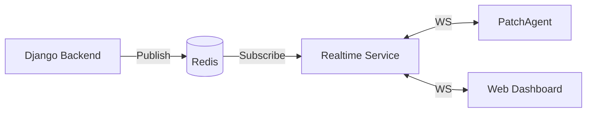

# PatchGuard Realtime Service (Websockets)

This service provides the real-time communication layer for PatchGuard, enabling bi-directional communication between the central server, the web dashboard, and remote agents.

## Overview

The service is built with **FastAPI** and uses **Websockets** for low-latency updates. It acts as an intermediary between the Django backend and the connected clients, using a **Redis Pub/Sub** message bus to receive events.

### Architecture



## Key Endpoints

### 1. Agent Websocket
- **Path**: `/ws/agent`
- **Authentication**: `api_key` query parameter.
- **Usage**: Remote agents connect here to receive commands (scans, patches, reboots) and send heartbeats/status reports.

### 2. Dashboard Websocket
- **Path**: `/ws/dashboard`
- **Authentication**: `token` query parameter (JWT from Django).
- **Usage**: The web frontend connects here to receive live deployment progress and system notifications.

### 3. REST API
- **GET /health**: Basic health check.
- **GET /rt/agents/online**: List currently connected device IDs.
- **GET /rt/stats**: Statistics on active connections.

## Configuration

The service reads configuration from the root `.env` file:

- `REDIS_URL`: Connection to the Redis broker (default: `redis://localhost:6379/0`).
- `DATABASE_URL`: Connection to the PostgreSQL database for agent authentication.
- `JWT_SECRET_KEY`: Used to verify dashboard tokens (must match Django's `SECRET_KEY`).

## Running the Service

### Locally (VS Code)
Use the `FastAPI: Run Server` launch configuration in VS Code. This will run the service on `http://localhost:8001`.

### Docker
```bash
docker compose up fastapi
```

## Troubleshooting

- **Connection Refused**: Ensure Redis is running and reachable at the `REDIS_URL`.
- **Invalid API Key**: Check that the agent's `api_key` matches the `agent_api_key` in the `inventory_device` table.
- **No Deployment Updates**: Verify that the Django backend is publishing to the `deployment:progress` channel in Redis.

## Development

To run tests:
```bash
cd realtime
pytest
```
